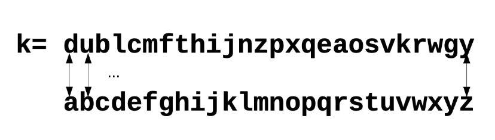
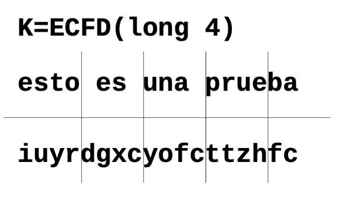

# Ejercicio 1
Dar una definición formal de los algoritmos Gen, Enc y Dec para los siguientes esquemas:
- Cifrado de rotación
- Cifrado de sustitución monoalfabética
- Cifrado de Vigenère


## 📋 Cifrado de rotación
- $Gen = k \in \{1, ..., 26\}$
- $Cod_1(m) = c/c_i = m_i >> k$
- $Dec_k(c) = m/m_i = c_i << k$

Este cifrado es simple, la clave es un numero entre 
 y la longitud del alfabeto. Para codificar un mensaje tenemos que rotar cada letra 
 veces en un sentido, y para decodificarlo debemos rotar a nuestro texto cifrado 
 veces en el sentido opuesto.

 ```Ejemplo: 
 m = "textoplano"
 k = 2
c[0] = m[0] >> 2 = 't' >> 2 = 'v'
c[1] = m[1] >> 2 = 'e' >> 2 = 'g'
...
c = "vgzvqrncpq"
```

## Cifrado por sustitucion monoalfabetica

- $Gen = k \subset\{(a,b)\}^*, a \in Alphabet, b \in Alphabet_2$
- $Cod_k(m)  = c/c_i = k[m_i]$
- $Dec_k(c) = m/m_i = k^{-1}[c_i]$

Este cifrado opera con una clave $k$ que es un diccionario, donde se mapea de forma biyectiva (una a una) los caracteres del alfabeto con los caracteres de otro alfabeto. Ambos alfabetos pueden ser los mismos.
```
alfabeto_a =  {a,b,c,d,e}
alphabeto_b = {1,2,3,4,5}
m = "ddecb"
k = {(a,1),(b,3),(c,5),(d,2),(e,4)}
c[0] = k[m[0]] = k['d'] = '2'
c[1] = k[m[1]] = k['d'] = '2'
...
c = "22453"
```

## Cifrado de Vigenère / sustitución poli alfabética 

| a | b | c | d | e | f | g | h | i | j | k | l | m | n | ñ | o | p | q | r | s | t | u | v | w | x | y | z |
|---|---|---|---|---|---|---|---|---|---|---|---|---|---|---|---|---|---|---|---|---|---|---|---|---|---|---|
| 0 | 1 | 2 | 3 | 4 | 5 | 6 | 7 | 8 | 9 | 10 | 11 | 12 | 13 | 14 | 15 | 16 | 17 | 18 | 19 | 20 | 21 | 22 | 23 | 24 | 25 | 26 |
- $Gen = k \subset\{a, ..., z\}^*\ tal\ que\ \#k = n $
- $Cod_k(m)  = c$
- $Dec_k(c) = m$

$C_i = (m_i + k_i) mod |A|$

Este cifrado depende de una clave $k$, de la cual también es importante su longitud $n$. Para cifrar un mensaje, tenemos que dividirlo en particiones de tamaño $n$ y aplicar un cifrado de rotación en base al valor de la clave en esa posición.

 # Ejercicio 2
 ¿Por qué la composición de dos sistemas de sustitución simple no provee más seguridad que el usode uno solo? Ejemplificar
 ## 📋 

Ya que la sustitucion es una funcion biyectiva (a cada elemento de la entrada le corresonde un unico elemento de la salida), la composicion de funciones biyectivas es biyectiva entonces la composicion de dos funciones de sustituciiones es lo mismo que una unica sustitucion

 # Ejercicio 3
Descifrar el siguiente criptograma, sabiendo que fue encriptado usando el cifrado de rotación, quese corresponde a un texto en español (27 letras) y los espacios fueron suprimidos ¿Cuál fue laestrategia que utilizaste?


V K X Y K B K X G K S G W A K Q Q G Y I U Y G Y W A K X K G Q R K S Z K J K Y K K Y I U S Y K


## 📋 
5 no
21 
rot 21
$\#V = 1$ -> p 

$\#K = 13$ -> e

$\#X = 3$ -> r

$\#Y = 7$ -> s

$\#B = 1$ -> v

$\#G = 5$ -> a

$\#S = 3$ -> n

$\#W = 2$ -> q

$\#A = 2$ -> u

$\#Q = 3$ -> l

$\#I = 2$ -> c

$\#U = 2$ -> o

$\#R = 1$ -> m

$\#S = 1$ -> n

$\#Z = 1$ -> t

<pre>
VKXYKBKXG    K S    G W A K Q Q G Y    I U Y G Y    W A K    X K G Q R K S Z K    J K Y K K Y    I U S Y K M A Ñ X  

persevera    en    aquellas    cosas    que    realmente    desees    conseguir
</pre>


 # Ejercicio 4
 <ol type="a">
  <li>Cifrar según Vigenère el mensaje M = UN VINO DE MESA con la clave K = BACO sin usar la tabla,sólo con operaciones modulares.</li>
  <li>En un sistema de cifra de Vigenère la clave a usar puede ser CERO o bien COMPADRE, ¿cuál delas dos conviene usar y por qué?</li>
  <li>Mostrar, con un ejemplo, que la composición de dos cifrados Vigenère resulta en otro cifradoVigenère</li>
</ol>


## 📋 

## a.
M = UN V|INO |DE M|ESA

K = BACO
abcdefghijklmnopqrstuvwxyz

C = VNBJ|WNQN|EECA

## b.
Conviene usar compadre ya que es mas larga y permite que se encuentren menos patrones.

## c.

### Composicion de vigenere
M=HO|LA

K1=BC & K2=AB

C1=IQ|MC

C2=IR|MD
### Suma de claves
M = HO|LA

K3 = BD
C3 = IR|MD

Por lo tanto la composiicon de Vigenere es lo mismo que una vigenere sumando las claves de la forma: A=0 B=1 C=2 .... si tenemos la clave BC y CD es lo mismo que utilizar una unica clave CF

# Ejercicio 5
Teniendo en cuenta que la frecuencia (aproximada) de aparición de letras en castellano es la siguiente:

|Letra| A | B |C| D | E | F | G | H | I | J | K | L | M | N | Ñ | O | P | Q | R | S | T | U | V | W | X | Y | Z |
|---|---|---|---|---|---|---|---|---|---|---|---|---|---|---|---|---|---|---|---|---|---|---|---|---|---|---|---|
|  % |  13 |  1 | 4  | 5  |  13 |  1 | 1  | 1  | 7  |  |   |5   | 3  |7   | 0  |9| 3| 1| 7| 8 | 4 | 4 | 1 | | | 1| |

Decir, para cada criptograma, si se ha obtenido mediante técnicas de sustitución monoalfabética,sustitución polialfabética o de transposición. (No hay que descifrarlos)

Los criptogramas son:

Criptograma 1: (50 caracteres)

K O Z F V P C Y V C W V Z H M Z L C I O H I F I Z G J C Z T V V X I G J L Z H Y Z L G V M N V L Y Z

Criptograma 2:(183 caracteres)

H H M B I W S I P S N N T A W V I T Q W M E A Q V N S P G Q J N W E L X M J D I B Y U G N N R M E U D E MZ I B T M Y M B M W U R B T I Z X N C W Z I U P Z U Q N R M E G J L W R V R O P M R E U M X X X A X D I PU V F E A S M B S A S C E T A E W O Y Y A K U S W E A B S A S C R E C I O M E W T Q O M Y A L M T X R A GE W S Q Q H J D X M V J E A F I R N D U I A N W

Criptograma 3: ( caracteres)

D E R T N Y L A N A O T A A B A D E A X C E E A I D E J L X H R S U A U J U M X E L A A T E C R T R N A Z B IR E S O X

Sustitucion Monoalfabetica: se debería mantener la frecuencia de cada letra (solo que ahora es otra)

Rotación:Las frecuencias deberian ser las mismas pero corridas x casilleros.

Sustitucion Polialfabetica: cambia la  probabilidad de cada letra


## 📋 
### Criptograma 1:
https://www.charactercountonline.com/

|Letra| A | B |C| D | E | F | G | H | I | J | K | L | M | N | Ñ | O | P | Q | R | S | T | U | V | W | X | Y | Z |
|---|---|---|---|---|---|---|---|---|---|---|---|---|---|---|---|---|---|---|---|---|---|---|---|---|---|---|---|
|  % |   |   | 8  |   |   |  4 | 6  | 6  | 8  | 4 |  2 |8   | 4  |  2 |   |4|2 | | |  | 2 |  | 14 | 2|2 | 6|16 |

parece rotacion de 22 (A es V).

### Criptograma 2:


|Letra| A | B |C| D | E | F | G | H | I | J | K | L | M | N | Ñ | O | P | Q | R | S | T | U | V | W | X | Y | Z |
|---|---|---|---|---|---|---|---|---|---|---|---|---|---|---|---|---|---|---|---|---|---|---|---|---|---|---|---|
|  % |   | 4  |  3 |  3 | 9  | 1  |  3 | 2  |   | 3 | 1  | 2  |  10 |  6 |   |3| 3|4 |6 |6  | 4 |6  |3  | 8|5 | 3|3 |

No parece tener una distribucion parecida a la del idioma castellano, supongo que es polialfabetica.

### Criptograma 3:


|Letra| A | B |C| D | E | F | G | H | I | J | K | L | M | N | Ñ | O | P | Q | R | S | T | U | V | W | X | Y | Z |
|---|---|---|---|---|---|---|---|---|---|---|---|---|---|---|---|---|---|---|---|---|---|---|---|---|---|---|---|
|  % |   | 4  | 4 | 6  |  17 |  |   |  2 |   |4  |   | 6  |  2 | 6 |   |4 | | | 11 | 4  | 9  | 6  |   |  | 9 | 2 | 2 |

No parece tener una distribucion parecida a la del idioma castellano, supongo que es polialfabetica.

# Ejercicio 6
Se recibe el siguiente criptograma:

JGAZ NWIN HYLZ DYVB BJLC QHTN KUDQ XMOX JNOZ MUSP NONY JMTE JHQH QFOO PUPB CYAÑ JONC NNQH NMON DHKU TJMQ CMOP NFAO XNTN LOAZ MJDQ YMOZ CJRN BAOQ TUIE NFAI XTLX JGAZ MJAX JVAZ MUDN MYLN LJMU MUYH VUMH TÑIG DXDQ UCLS JPIB CUSF NUGX XGEE XKAE JMES JÑEN ASLH LBAE YJRO JXAC QTCN MYPU CUNM JWOY NHZN KUOG AJDU JXEN RYTE NJSC NMON TYJN MJYF XFIG JMIB UUSN TFAP NFAF KURO JNYC TUYN BYSG JVAC AUCG QWAZ MJJH JHSN TPAP XMGN ECOG JUTE NCNG JGEG AJSP NULG DMAÑ JDOF DNPU NNPN TGEN MJSN TTOF DKIO XSSQ NNFB ATOC XMMN VÑEZ NMEZ BOSN TUSQ BUDB TJRB BUYP QZIO QFTB ANIB VMED DYRU MUPN AULB OMAE DHVH NFOC JOSN MJ
 
Si se conoce que ha sido cifrado mediante el algoritmo de Vigenère, se pide:
<ol type="a">
  <li>Comprobar la longitud de la clave.</li>
  <li>Encontrar la clave del sistema y desencriptar sólo los diez primeros caracteres.Para ello tener en cuenta lo siguiente:
  
  - listar todas las secuencias repetidas de por lo menos 3 caracteres, junto con la distancia ala que se encuentran.
  
  - Ayuda: Aparecen cuatro cadenas de cuatro caracteres que se repiten en el criptograma:JGAZ, NMON, PNFA y AZMJ.
  
  - Estimar cuál puede ser la longitud y obtener la frecuencia de aparición de cada letra comoprimera de cada bloque</li>
</ol>

## 📋 
## a.
Busco si se repiten patrones:

| secuencia | repeticiones |
| --- | --- |
|JSAZ | 2|
| NMJ | 4|
| OSN | 2|
| UMU | 2|
| SNT | 4|
| AÑJ | 2|
| SPN | 2|
| GAJ | 2|
| NCN | N|
| TEN | 2|
| AZMJ| 3|

En este momento me lei la ayuda y fue como fuuuuuuuuuuuuuuck ya estaba hecho estooo

Cuestion que hayan varias cadenas de 4 caracteres que se repiten, te da un indicio de que la clave es de 4 caracteres

# Ejercicio 7
Se cuenta con un texto cifrado que es producto de transposición por columnas (cada “n” columnas se reacomodó el texto original) y un cifrado de rotación.
<ol type="a">
  <li> ¿Qué estrategia usarías para recuperar el mensaje original?</li>
  <li> Si el texto cifrado tiene “m” caracteres, ¿cuántas pruebas requeriría un ataque de fuerzabruta?</li>
</ol>

## 📋 
## a.
Primero, obtener k a partir de frecuencias del idioma. Luego, reordenar texto.

Ejemplo: HHAVWWWHR

Como la letra más frecuente en español es la E, podemos estimar que H reemplaza la E. (o W)

En el caso de que la H reemplace la E, significaría que k = 3.

Entonces queda: EEXSTTTEO

Luego se reordenan las letras:N = 2 Falla

EE

XS

TT

EO

N = 3 CORRECTO!

EEX

STT

TEO

→ESTETEXTO

## b.
Solo teniendo en cuenta la rotacion tiene 26 posibilidades, y luego tiene  m-1 posibilidades por lo de las columnas. Por lo que a fuerza bruta son 26* (m-1)

# Ejercicio 8
Mostrar que los siguientes cifrados son muy fáciles de quebrar mediante un ataque de texto plano elegido (chosen-plaintext attack).
- cifrado de sustitución monoalfabética
- cifrado de Vigenère

## 📋 

### Ataque de Texto Cifrado Escogido (CCA)
También conocido como Chosen-Ciphertext Attack, el adversario puede obtener el texto plano a partir de cualquier texto cifrado que quiera. A partir de eso debe descifrar un mensaje distinto.

Si un criptosistema no es susceptible a este tipo de ataques, entonces se lo conoce como CCA-Secure.

## Cifrado de sustitucion monoalfabetica
Comienzo con el texto cifrado:

abcdefghijklmnopqrstuvwxyz

y de aqui obtendre el texto plano. Luego con cualquier texto cifrado puedo saber cual es su texto plano ya que se por que letra se remplaza cada una. 


## Cifrado de Vigenère

Para este caso comenzaria con un texto cifrado de la siguiente forma:

aaaaaaaaaaaaaaaaaaaaaaaaaaaaaaa

De esta forma voy a saber la longitud de la clave ya que va a haber un patron que se repite de una cierta longitud. Y voy a saber la clave en si ya que obteniendo el texto plano voy a saber la rotacion de cada una.